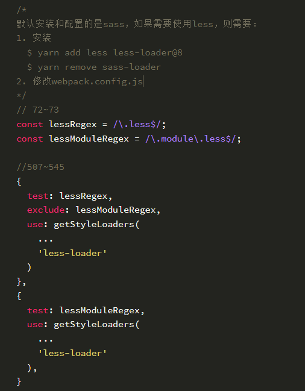
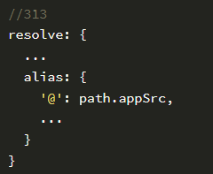
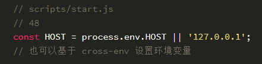
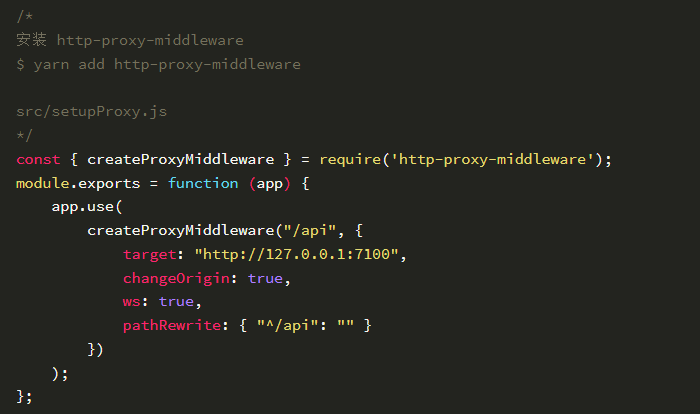
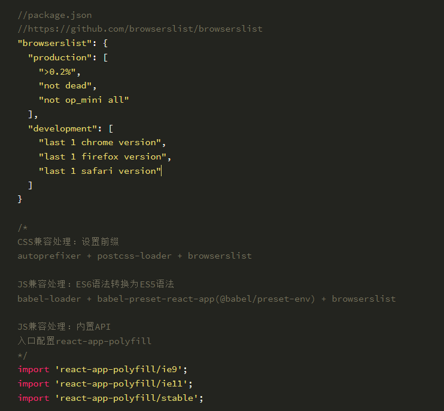

# 学习React
###  使用 create-react-app 构建React工程化项目
安装create-react-app
- npm i create-react-app -g 「mac需要加sudo」

基于脚手架创建项目「项目名称需要符合npm包规范」
- create-react-app xxx

package.json

默认情况下，会把webpack配置项隐藏到node_modules中，如果想修改，则需要暴露配置项：
- yarn eject

真实项目中常用的一些修改操作
- 配置less

- 配置别名

- 配置预览域名

- 配置跨域代理

- 配置浏览器兼容
